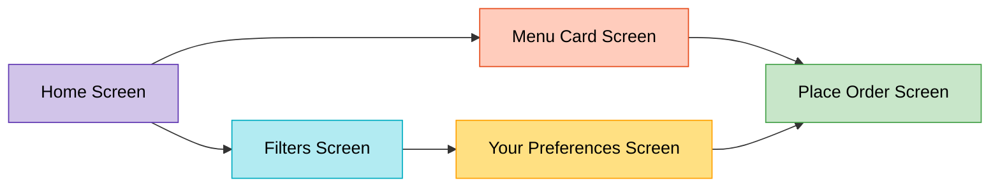

# Food Ordering App

A Flutter-based mobile application for a smooth and intuitive food ordering experience. This app allows users to browse cuisines, filter items based on budget and rating, explore restaurant menus, and place orders with a clear breakdown of costs.

---

## Demo Video

Watch the app in action:  
[▶️ View Demo](https://drive.google.com/file/d/1075Do8MkqyMXkcBH02WftBy9vgBv91Zi/view?usp=sharing)

---

## Features

### Home Screen
- Browse available cuisine types in a horizontal scroll view.
- View top-rated dishes with star ratings.
- See your most recent order including date/time, order ID, and total bill.

### Filters
- Select cuisine type from a dropdown.
- Define price range with minimum and maximum values.
- Set a minimum rating filter using a slider.
- Option to clear all filters.
- Apply filters to update home screen results.

### Menu Screen
- Displays a list of menu items with image, name, and price.
- Add items to the cart using the "+" button.
- Navigate to checkout using the "Proceed to Checkout" button.

### Place Order Screen
- Shows selected items with quantity and price.
- Automatically calculates:
  - Subtotal
  - Tax (5%)
  - Grand total
- Confirm and place the order using the "Place Order" button.

---

## Tech Stack

- **Flutter** – UI development
- **Dart** – Application logic
- **Provider** – State management
- **Material Design** – UI components

---

## Getting Started

Follow the steps below to run the project locally:

### 1. Clone the Repository

```bash
git clone <your-repo-url>
cd your-repo-folder
```

### 1. Add Dependencies

```bash
flutter pub get
```

### 3. Run the App

```bash
flutter run
```

## 🧭 App Flowchart



